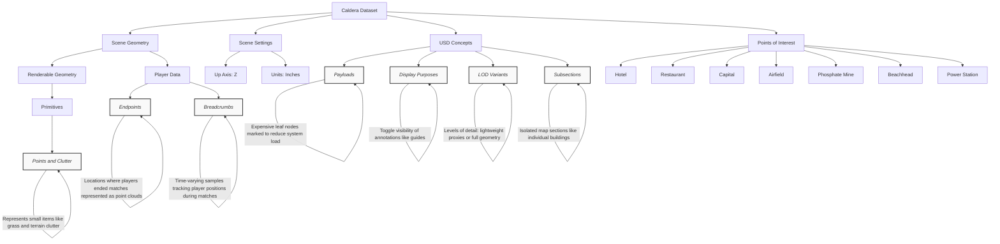

```mermaid
graph TD
    A[Caldera Dataset]

    %% First Layer
    A --> B[Scene Geometry]
    A --> C[Scene Settings]
    A --> D[USD Concepts]
    A --> E[Points of Interest]

    %% Scene Geometry Layer
    B --> B1[Renderable Geometry]
    B1 --> B2[Primitives]
    B2 --> B3[Points and Clutter]
    B --> B4[Player Data]
    B4 --> B5[Endpoints]
    B4 --> B6[Breadcrumbs]

    %% Scene Settings Layer
    C --> C1[Up Axis: Z]
    C --> C2[Units: Inches]

    %% USD Concepts Layer
    D --> D1[Payloads]
    D --> D2[Display Purposes]
    D --> D3[LOD Variants]
    D --> D4[Subsections]

    %% Points of Interest Layer
    E --> E1[Hotel]
    E --> E2[Restaurant]
    E --> E3[Capital]
    E --> E4[Airfield]
    E --> E5[Phosphate Mine]
    E --> E6[Beachhead]
    E --> E7[Power Station]

    %% Descriptions
    B3:::description
    B3:::description -->|"Represents small items like grass and terrain clutter"| B3
    B5:::description
    B5:::description -->|"Locations where players ended matches represented as point clouds"| B5
    B6:::description
    B6:::description -->|"Time-varying samples tracking player positions during matches"| B6
    D1:::description
    D1:::description -->|"Expensive leaf nodes marked to reduce system load"| D1
    D2:::description
    D2:::description -->|"Toggle visibility of annotations like guides"| D2
    D3:::description
    D3:::description -->|"Levels of detail: lightweight proxies or full geometry"| D3
    D4:::description
    D4:::description -->|"Isolated map sections like individual buildings"| D4

    %% Styling
    classDef description fill:#f9f9f9,stroke:#333,stroke-width:2px,font-style:italic
```
